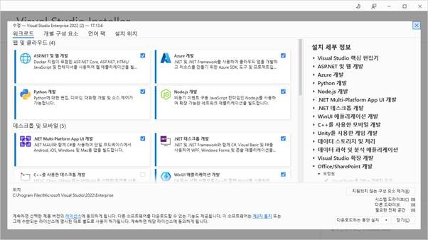
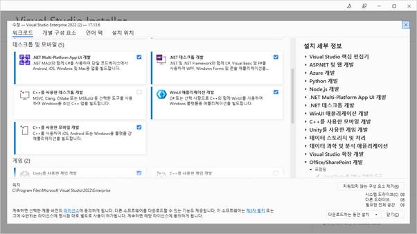
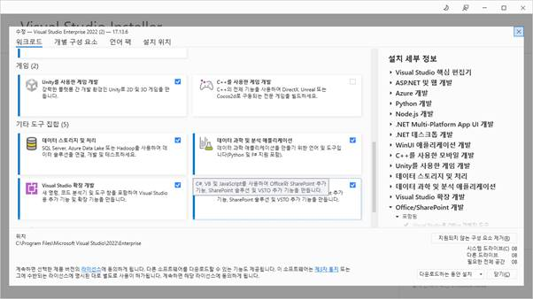
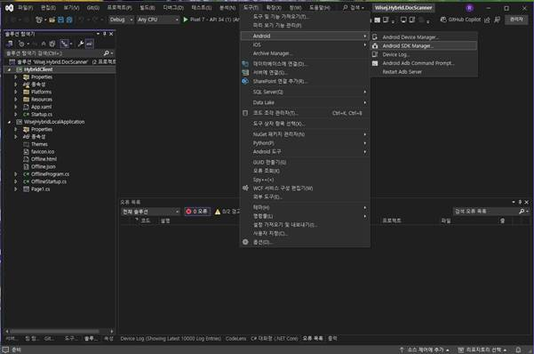
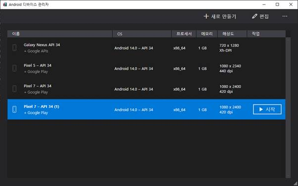
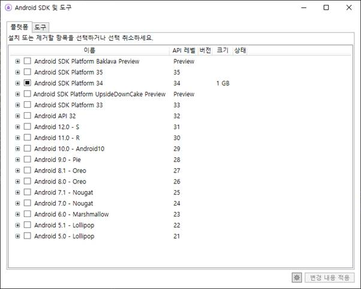

WiseJ로 Android, IOS 개발을 위해서 VS2022 설치 내용

성공적으로 설치가 완료 되면 안드로이드 SDK 메니저를 볼 수 있습니다.

디바이스 관리자로 해당 핸드폰 에뮬레이터를 확인 합니다.

Android SDK Manager 플랫폼

Android SDK Manager 도구

프로그램을 실행 하면 다음과 같은 화면을 볼 수 있습니다.

 

 

 

 

Android Emulator 화면 스플래쉬

 

 

 

디버깅 화면 입니다.

